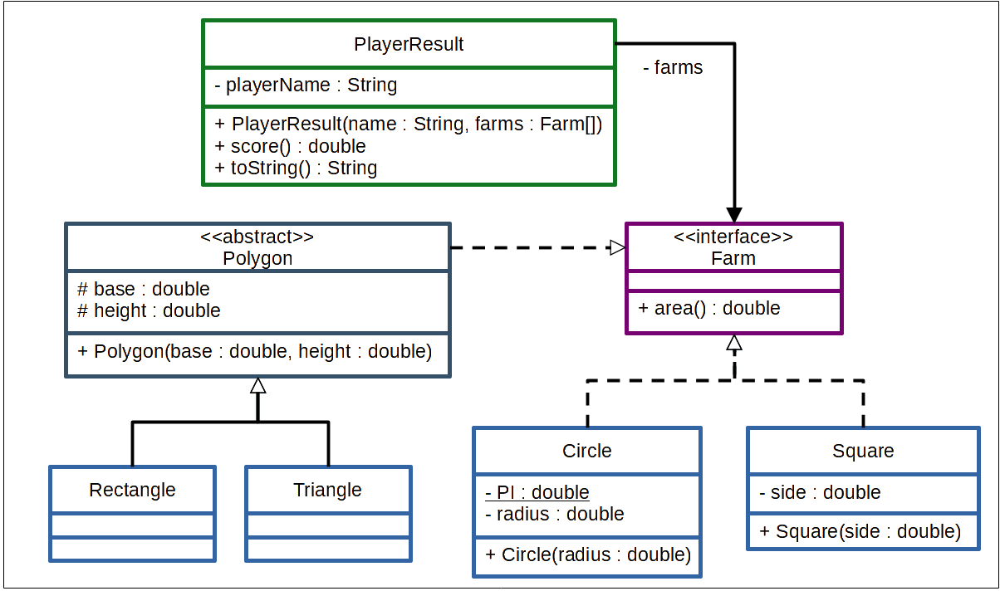

# Boas vindas ao repositório do desafio da Aceleração Java!

# Requisitos do desafio

### Descrição do desafio: Área das fazendas

Imagine um jogo onde as pessoas jogadoras são fazendeiras e a pessoa vencedora é aquela que possui a maior quantidade de terras. Para desenvolver este jogo, precisamos calcular a área das fazendas de cada pessoa jogadora. Considere quatro formas possíveis das fazendas: triângulo, quadrado, retângulo e círculo.

Crie um programa usando a linguagem Java que calcule a área de diferentes fazendas. As fazendas na forma quadrada possuem o atributo lado, as circulares possuem o atributo raio e as fazendas triangulares e as retangulares possuem os atributos base e altura. Ao escrever as classes do seu programa, tome como base o diagrama UML a seguir:

Vamos colocar em prática as habilidades aprendidas nesta lição?

> **Dica**: apesar de a forma de um quadrado ser mais parecida com a de um retângulo, a melhor maneira de escrever o programa é considerar que o triângulo e o retângulo têm mais características em comum.

---
