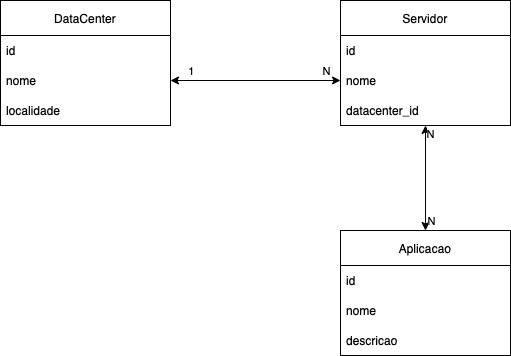

# Boas vindas ao repositório do desafio da Aceleração Java!

# Requisitos do desafio

### Datacenter

A empresa em que você trabalha como pessoa desenvolvedora foi contratada para catalogar todas as aplicações que estão rodando dentro de um Data Center. Tá aí uma oportunidade para você mostrar tudo o que aprendeu e ainda contribuir com um desafio. 🤗

Depois de muitas reuniões com a empresa cliente, foi entendido que:
- Dentro de um data center há vários servidores;
- Cada servidor possui múltiplas aplicações;
- Uma mesma aplicação pode estar replicada em vários servidores.

Para auxiliar você e sua equipe, o seguinte mapeamento foi levantado:

Sua missão aqui será criar as entidades mapeadas na imagem acima e criar uma classe de serviço para cada entidade que será responsável por:
    - _Encontrar_, no banco de dados, um ítem por id (`find`)
    - _Salvar_ um item no banco de dados (`persist`)
    - _Atualizar_ um item no banco de dados (`merge`)
    - _Remover_ um item do banco de dados (`remove`)

Compreendido? A empresa cliente espera que sim, então foco na solicitação e mãos no código! 🙌
