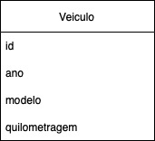

# Boas vindas ao repositório do desafio da Aceleração Java!

# Requisitos do desafio

### Guardando Veículos

Chegou a grande hora, a mais esperada: é a sua vez de persistir um dado em uma tabela do MySQL! Para isso, você deve criar uma entidade chamada `Veiculo` que armazenará na tabela o ano, modelo e a quilometragem rodada. 🚗

Como parte do desafio, é fundamental que seja **respeitada a nomenclatura abaixo**:



Para o desafio, iremos precisar de um MySQL, mas não se preocupe com isso, já que no repositório do código fonte tem um `docker-compose.yml` pronto para subir seu MySQL. Apenas rode o comando no diretório raiz do repositório:

```shell
docker-compose up
```

Seu objetivo neste desafio é implementar a entidade Veículo e o método `main`, que vai instanciar um objeto do tipo `Veiculo`, e persistir esse dado no MySQL.

**Não se esqueça de criar os métodos _getters_ e _setters_ na sua entidade**, combinado?

Chega de papo e mãos à obra!! 👷‍♀️
