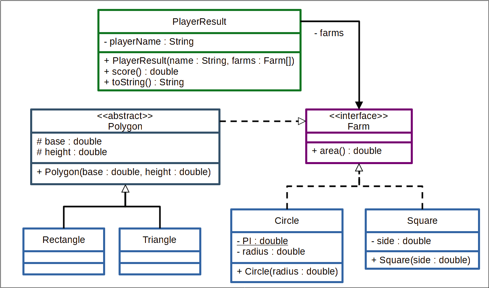

<<<<<<< HEAD
### Termos e acordos

Ao iniciar este projeto, você concorda com as diretrizes do Código de Ética e Conduta e do Manual da Pessoa Estudante da Trybe.

---

# Boas vindas ao repositório do desafio da Aceleração Java!

Você já usa o GitHub diariamente para desenvolver os exercícios, certo? Agora, para desenvolver o desafio, você deverá seguir as instruções a seguir. Fique atento a cada passo, e se tiver qualquer dúvida, nos envie por _Slack_! #vqv 🚀

Aqui você vai encontrar os detalhes de como estruturar o desenvolvimento do seu desafio a partir deste repositório, utilizando uma branch específica e um _Pull Request_ para colocar seus códigos.

---
# Instruções para entregar seu projeto

## Não se esqueça de consultar as documentações!

⚠️ **Importante**:

Esse projeto tem como intuito te treinar para ter mais familiaridade com a documentação de aplicações, por tanto, poderão haver alguns comandos ou atributos que não estão no curso, mas que devem ser descritos no decorrer dos requisitos.

Nesses casos, é importante se atentar a aquilo que o requisito pede, e lembrar sempre de utilizar a [documentação oficial](https://docs.oracle.com/en/java/javase/11/) do Java para pesquisar detalhes sobre comandos.

## Antes de começar a desenvolver

Lembre-se que você pode consultar nosso conteúdo sobre [Git & GitHub](https://course.betrybe.com/intro/git/) sempre que precisar!

1. Clone o repositório
  * Por exemplo: `git clone git@github.com:tryber/desafio-aceleracao.git`
  * Entre no diretório do repositório que você acabou de clonar:
    * neste caso `cd desafio-aceleracao`

2. Instale as dependências:
    * `mvn install`

3. Crie uma branch a partir da branch `main`

  * Verifique que você está na branch `main`
    * Exemplo: `git branch`
  * Se não estiver, mude para a branch `main`
    * Exemplo: `git checkout main`
  * Agora, crie uma branch onde você vai guardar os commits do seu desafio
    * Você deve criar uma branch no seguinte formato: `nome-de-usuario-nome-do-desafio`
    * Exemplo:
      * `git checkout -b joaozinho-acc-java-sample`

4. Adicione a sua branch com o novo `commit` ao repositório remoto

  - Usando o exemplo anterior:
    - `git push -u origin joaozinho-acc-java-sample`

5. Crie um novo `Pull Request` _(PR)_
  * Vá até a aba de _Pull Requests_ deste repositório no GitHub
  * Clique no botão verde _"New pull request"_
  * Clique na caixa de seleção _"Compare"_ e escolha a sua branch **com atenção**
  * Clique no botão verde _"Create pull request"_
  * Adicione uma descrição para o _Pull Request_ e clique no botão verde _"Create pull request"_
  * **Não se preocupe em preencher mais nada por enquanto!**
  * Volte até a página de _Pull Requests_ do repositório e confira que o seu _Pull Request_ está criado
 
 ⚠️ **Lembre-se do CheckStyle! Deixe seu Eclipse configurado para arrumar o estilo automaticamente. Qualquer dúvida, volte no conteúdo.**

---

## Durante o desenvolvimento

* ⚠ **PULL REQUESTS COM ISSUES NO CHECKSTYLE NÃO SERÃO AVALIADAS, ATENTE-SE PARA RESOLVÊ-LAS ANTES DE FINALIZAR O DESENVOLVIMENTO!** ⚠

* Faça `commits` das alterações que você fizer no código regularmente

* Lembre-se de sempre após um (ou alguns) `commits` atualizar o repositório remoto

* Os comandos que você utilizará com mais frequência são:
  1. `git status` _(para verificar o que está em vermelho - fora do stage - e o que está em verde - no stage)_
  2. `git add` _(para adicionar arquivos ao stage do Git)_
  3. `git commit` _(para criar um commit com os arquivos que estão no stage do Git)_
  4. `git push -u origin nome-da-branch` _(para enviar o commit para o repositório remoto na primeira vez que fizer o `push` de uma nova branch)_
  5. `git push` _(para enviar o commit para o repositório remoto após o passo anterior)_

---

## Depois de terminar o desenvolvimento (opcional)

Para **"entregar"** seu projeto, siga os passos a seguir:

* Vá até a página **DO SEU** _Pull Request_, adicione a label de _"code-review"_ e marque seus colegas
  * No menu à direita, clique no _link_ **"Labels"** e escolha a _label_ **code-review**
  * No menu à direita, clique no _link_ **"Assignees"** e escolha **o seu usuário**
  * No menu à direita, clique no _link_ **"Reviewers"** e digite `students`, selecione o time `tryber/students-sd-0x`

Se ainda houver alguma dúvida sobre como entregar seu projeto, [aqui tem um video explicativo](https://vimeo.com/362189205).

---

# Requisitos do desafio

### Descrição do desafio: Área das fazendas

Imagine um jogo onde as pessoas jogadoras são fazendeiras e a pessoa vencedora é aquela que possui a maior quantidade de terras. Para desenvolver este jogo, precisamos calcular a área das fazendas de cada pessoa jogadora. Considere quatro formas possíveis das fazendas: triângulo, quadrado, retângulo e círculo.

Crie um programa usando a linguagem Java que calcule a área de diferentes fazendas. As fazendas na forma quadrada possuem o atributo lado, as circulares possuem o atributo raio e as fazendas triangulares e as retangulares possuem os atributos base e altura. Ao escrever as classes do seu programa, tome como base o diagrama UML a seguir:

Vamos colocar em prática as habilidades aprendidas nesta lição?

> **Dica**: apesar de a forma de um quadrado ser mais parecida com a de um retângulo, a melhor maneira de escrever o programa é considerar que o triângulo e o retângulo têm mais características em comum.

---

# Avisos Finais

Ao finalizar e submeter o desafio, não se esqueça de avaliar sua experiência preenchendo o formulário. Leva menos de 3 minutos!

Link: [Formulário](https://be-trybe.typeform.com/to/PsefzL2e)

O avaliador automático não necessariamente avalia seu projeto na ordem em que os requisitos aparecem no readme. Isso acontece para deixar o processo de avaliação mais rápido. Então, não se assuste se isso acontecer, ok?

---
=======
# Bootcamp CI&T e Trybe

Este repositório contém todas as atividades de aprendizagem desenvolvidas por [Renato Marques da Silva](https://github.com/renatomak) durante o Bootcamp CI&T desenvolvido pela Trybe:

O programa conta com mais de 360 horas de aulas presenciais e online, aborda introdução ao desenvolvimento de software na linguagem Java e habilidades comportamentais.

## Semana 01:
30/03 - Essenciais de Java - Variáveis e seus tipos:
- [x] Antecessor e sucessor
- [x] Calcula area
- [x] Calcula IMC
- [X] Converte bytes
- [X] Estado da lampada
- [X] Fatorial
- [X] Soma elementos
- [X] Conexão discada
- [X] Números pares
- [X] Estado brasileiro
- [X] Números aleatórios

31/03 - Essenciais de Java - Finalmente, o 'Hello, world!' em Java!
- [x] Idade em dias
- [X] Média anual
01/04 - Desafio Agregador
- [X] Controle de Acesso

## Semana 02:
05/04 - Orientação a objetos - Abstração: as Classes em Java

- [x] Conta poupança

05/04 - Orientação a objetos - Getters e Setters
- [X] Encapsulamento-recursos-humanos

06/04 - Orientação a objetos - Encapsulamento e Herança
- [x] Gerar pessoa usuária
>>>>>>> 2ee6a96a3fe2660631e1cd1dbe09cdefa5e0d704
